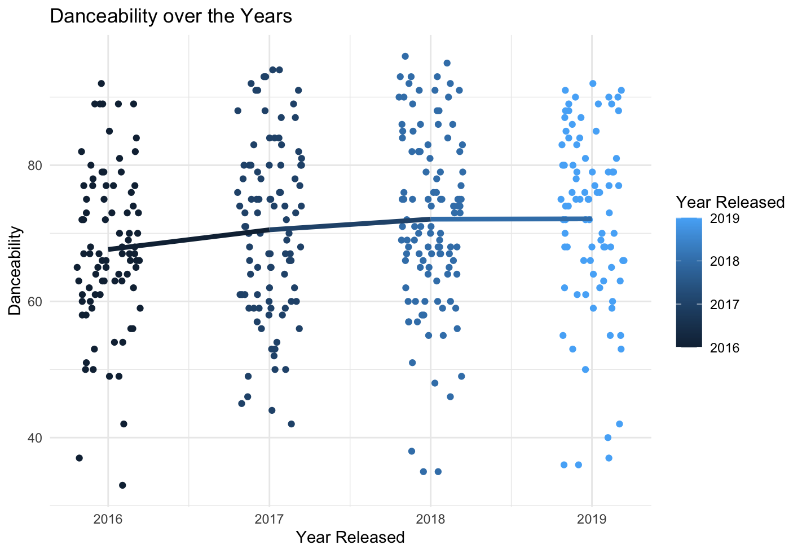
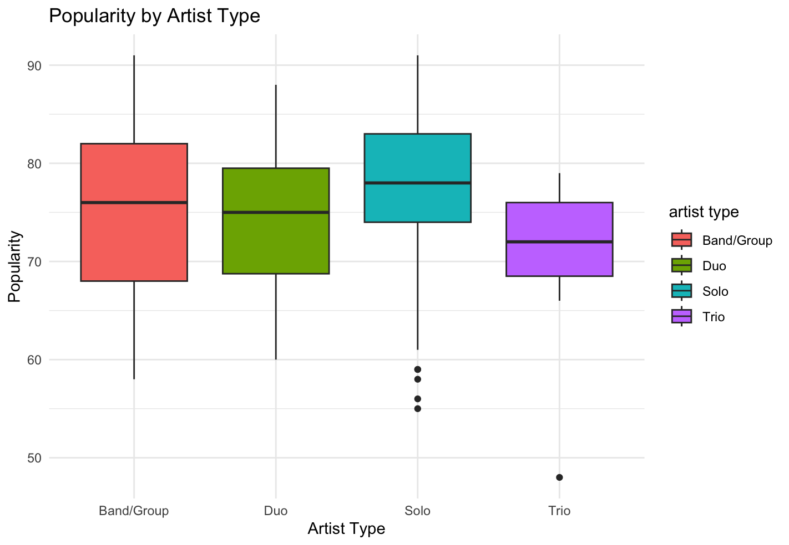

# Social Media & Consumer Data Analysis

A portfolio of data-analysis projects spanning graph theory on real social networks (Python/NetworkX) and exploratory analysis of music streaming data (R/ggplot2/SQL).

## Projects

### 1. [Social Network Analysis](network-analysis) — Twitter & Facebook graphs

Graph analysis of the Stanford SNAP [ego-Twitter](https://snap.stanford.edu/data/ego-Twitter.html) (~81k nodes, 1.7M directed edges) and [ego-Facebook](https://snap.stanford.edu/data/ego-Facebook.html) (~4k nodes, 88k edges) datasets with **NetworkX**, answering questions like *who are the most influential users* and *how does information flow through a network*:

- **Centrality** — degree, betweenness, closeness, and eigenvector centrality plus PageRank to rank the most connected and most influential nodes
- **Structure** — network density, diameter, shortest-path distributions, clustering coefficients, triangles, and degree assortativity
- **Communities** — greedy modularity and Louvain community detection, visualized with color-coded spring layouts
- **Robustness** — bridges and local bridges that hold the network together

```bash
pip install networkx pandas matplotlib numpy python-louvain jupyter
jupyter notebook network-analysis/network_analysis.ipynb
```

### 2. [Spotify Top-100 EDA](spotify-eda) — what makes a hit song? (R)

Exploratory analysis of the Spotify Top 100 songs from 2016–2019 using **ggplot2**, **dplyr**, and **SQL (sqldf)**:

- Cleaned and renamed raw audio-feature columns (BPM, energy, danceability, valence, etc.)
- Visualized danceability trends over time, popularity and BPM by artist type, and genre popularity (rap vs. pop vs. everything else)
- SQL queries ranking the most popular artists, the biggest one-hit wonders, the top duos/trios/bands, and a query that builds a 120-song max-energy party playlist

| | |
|---|---|
|  |  |

## Related Work

**[Betting-engagement-using-sentiment-analysis](https://github.com/Chalamar/Betting-engagement-using-sentiment-analysis)** — a companion study using sentiment analysis, OLS regression, and Mann-Whitney U testing on ~8,400 tweets to quantify engagement differences between FanDuel and DraftKings.

## Tools

`Python` `NetworkX` `pandas` `matplotlib` `R` `ggplot2` `dplyr` `sqldf` `Jupyter`
